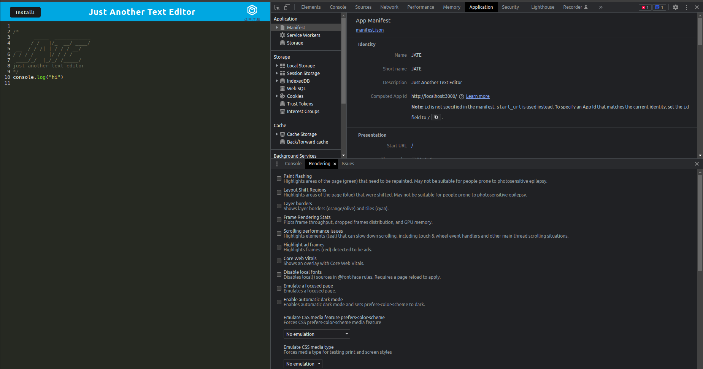
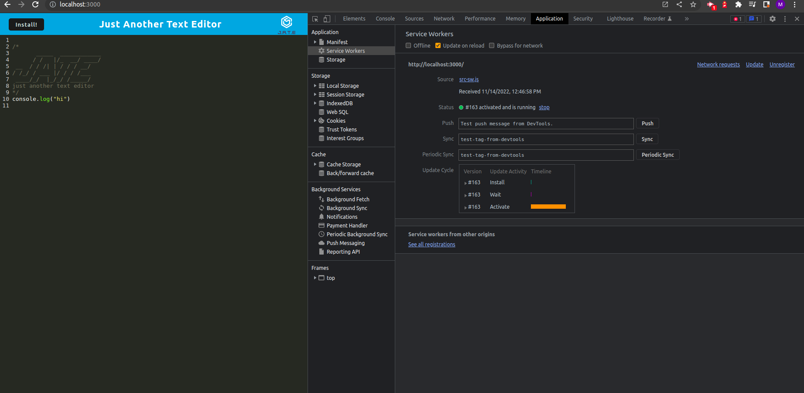
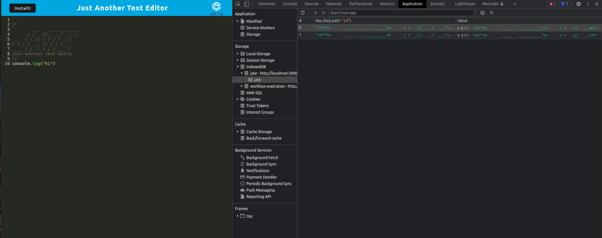

# text-editor-ms

## Table of Contents
-[Description](#description) 
-[Installation](#installation) 
-[Usage](#usage)
-[License](#license)
-[Contributing](#contributing) 
-[Tests](#tests) 
-[Questions](#questions) 
-[Depolyment](#depolyment)

## Description of the Project
The purpose of the application is to build Progressive Web Application (PWA). This dynamic application allows users to write in the text editor called JATE.

Upon creating this PWD, several devDependencies were used to improve optimization by bundling files together. Webpack is a static module bundler. Css loader and style loader bundles css. Babel allows older browser to read our ES6 code. HTML webpack plugin helps automate and generate HTML in the dist directory. Concurrently is a npm package that runs two node process from the same terminal. IDB is a dependency for client-side storage of significant amounts of structured data.
 
This application uses Node.js, IDB, and Express to run the application. This application requires you to understand package.json and its node_modules. In additon to that, gitignore file is important to use so certain folders and files are not upload to GitHub. For example, node_modules should not be uploaded to GitHub since this folder gets created during the installition process. With a simple installation, this PWA focuses on optimaization and works offline given that the application has client server worker, server and manifest.json.

## Installation
To create this project, follow these several steps. This application uses several packages, such as Node.js, IDB (version 6.1.2), and Express (version 4.18.1). Step one, download Node.js. Next go to the terminal of the index.js and type this command ```npm install```. This creates package.json file and its dependencies. 


## Usage
To use this application, open the terminal, respective to the file. Run the ```npm run start``` to run the application. This command builds/bundles webpack and runs the server.

This is what the Text Editor:JATE looks like.





## License
This application does not require any licenses.

## Contributing
If you would like to contribute to this project, please email me. My email can be found in the Questions section.

## Tests
Currently, there is no tests for this project.

## Questions

For more information about this application, please email me at melissastan91@gmail.com. Interested in my work? Checkout my GitHUb repositories. My GitHub username is mstan19, and here is my GitHub profile: https://github.com/mstan19.

## Depolyment
Click on this link for deployed application
https://jate-text-editor-ms.herokuapp.com/

## Repo
https://github.com/mstan19/text-editor-ms
